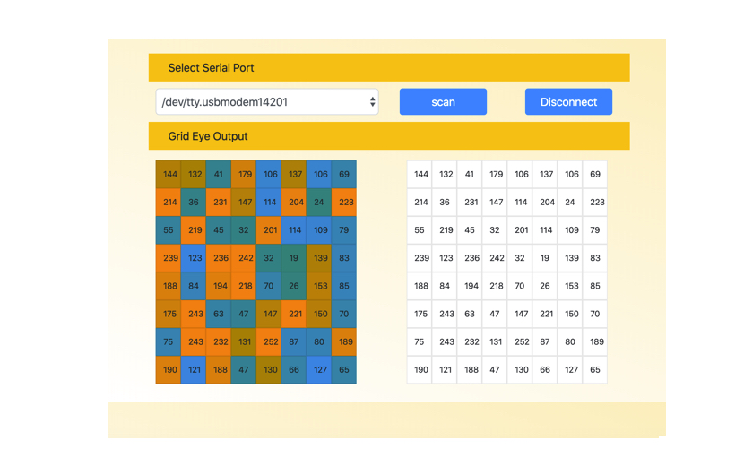

## Desktop application for a grid eye sensor ( Based on Electron.js )

##  How to run this application

	1. git clone <this_repo>
	2. cd <this_repo>
	3. cd src
	4. chmod 777 install.sh
	5. ./install.sh    [ If there is an error, try running ./install_on_error.sh ]
	6. ./run.sh

## Test Cases [ grid_eye_simulator ]
    
    $cd test_case/gyro_simulator

gyro simulator test cases is tested with Arduino Uno.

